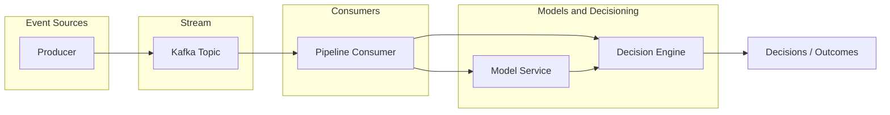

# Event Streaming Pipelines: Models and Decisioning Engines

Tutorial repo for engineers: runnable pipeline **events → Kafka → consumer → model (score) → decision engine → outcomes**.

## Overview

This tutorial shows a minimal event streaming pipeline that:

1. **Producer** emits synthetic events to a Kafka topic.
2. **Consumer** reads events, calls a **model service** for a score, then a **decision engine** for a decision.
3. **Model service** returns a numeric score (deterministic stub; replace with a real model).
4. **Decision engine** applies rules (event type + score bands) and returns an action (e.g. `offer`, `recommend`, `no_op`).

## Architecture



## Data flow

### Event schema

Events on the `events` topic have a minimal schema:

| Field        | Type   | Description                    |
|-------------|--------|--------------------------------|
| `user_id`   | string | e.g. `user_0`, `user_1`, …     |
| `event_type`| string | `click`, `view`, `purchase`, `signup` |
| `timestamp` | number | Unix timestamp                 |
| `payload`   | object | e.g. `{"count": 1}`            |

### Model service

- **Input:** `POST /score` with body `{"event": <event>}`.
- **Output:** `{"score": <float>}` in `[0, 1]`. The stub uses `event_type` and `payload.count` for a deterministic score (e.g. `purchase` → higher, `view` → lower).

### Decision engine

- **Input:** `POST /decide` with body `{"event": <event>, "score": <float>}`.
- **Output:** `{"action": "<action>", "reason": "<reason>"}`. Rules:
  - **High score (≥ 0.7):** `action: "offer"`, `reason: "high_score"`.
  - **Medium score + purchase/signup:** `action: "recommend"`, `reason: "medium_score_conversion"`.
  - **Purchase event:** `action: "log_high_value"`, `reason: "purchase_event"`.
  - **Low score (< 0.4):** `action: "no_op"`, `reason: "low_score"`.

## Run the tutorial

**Prerequisites:** Docker and Docker Compose.

```bash
cd event-streaming-tutorial
docker compose up --build
```

- **Kafka** starts first (Bitnami Kafka, KRaft mode); the producer and consumer wait for it.
- **Model service** and **decision engine** listen on ports 8000 and 8001.
- **Producer** sends events to the `events` topic at ~2 events/sec (configurable via `EVENTS_PER_SEC`). If the topic doesn't exist, Kafka will create it on first produce (default in many setups).
- **Consumer** reads from `events`, calls the model then the decision engine, and logs each result to stdout.

You should see lines like:

```
consumer  | event: purchase score: 0.9 decision: {'action': 'log_high_value', 'reason': 'purchase_event'}
consumer  | event: view score: 0.21 decision: {'action': 'no_op', 'reason': 'low_score'}
```

To run only infrastructure and one-off producer/consumer:

```bash
docker compose up -d kafka model_service decision_engine
# then run producer/consumer locally (set KAFKA_BOOTSTRAP_SERVERS=localhost:9092, etc.) or run them in the stack as-is.
```

## Key concepts

### Why stream events into a model and decision engine?

- **Decoupling:** Producers don’t need to know about scoring or business rules; the stream is the contract.
- **Scale:** You can add more consumers or partition the topic to handle throughput; the model and decision services stay stateless.
- **Flexibility:** Swap or version the model and rules without changing producers or the stream schema (if you keep the same event shape).

### Streaming vs batch

Here, events are processed **one-by-one** as they arrive (streaming). Batch would mean consuming in chunks or running on a schedule over stored data. Streaming fits low-latency decisions (e.g. real-time offers); batch fits reporting or training pipelines.

### Why separate “model” and “decision”?

- **Model:** Encapsulates prediction (score, propensity, etc.). Often owned by ML/platform; versioned and A/B tested.
- **Decision engine:** Encapsulates business rules (thresholds, segments, routing). Often owned by product or ops; changes more frequently. Keeping them separate lets you change rules without retraining and run multiple decision strategies over the same score.

### At-least-once and idempotency

Kafka consumers typically give **at-least-once** delivery: the same event can be processed more than once after a crash or rebalance. For production, make the **decision** step idempotent (e.g. key by `event_id` or `(user_id, timestamp)` and skip or overwrite duplicates) so duplicate processing doesn’t double-apply side effects (e.g. sending two offers).

## Repo layout

```
event-streaming-tutorial/
├── README.md
├── docker-compose.yaml
├── producer/          # Produces synthetic events to Kafka
├── consumer/          # Consumes events, calls model + decision, logs
├── model_service/     # POST /score
└── decision_engine/   # POST /decide
```

## Next steps

- **Observability:** Add metrics (e.g. consumer lag, request latency) and tracing (e.g. OpenTelemetry) so you can monitor the pipeline in production.
- **Schema registry:** Use a schema registry (e.g. Confluent Schema Registry) to version and validate event schemas.
- **Feature store:** Feed the model from a feature store (online/offline) instead of raw events for richer, consistent features across training and serving.
- **Alternatives:** Use **Kafka Streams** or **ksqlDB** for stream processing (filtering, joins, windows) before calling the model. Use **SQS**, **Pub/Sub**, or other cloud queues if you don’t need Kafka’s ordering or retention.
