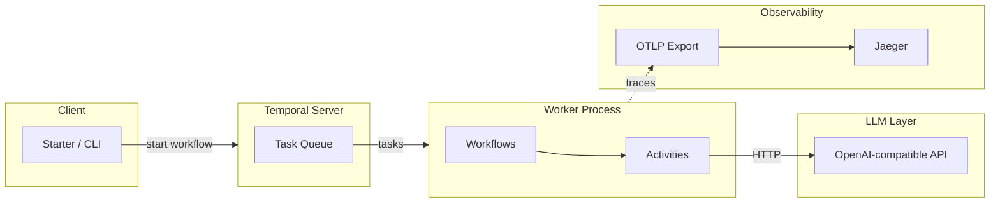

# Lightweight LLM Workflow Orchestrator

A minimal orchestrator for LLM workflows built on [Temporal](https://temporal.io/) with full [OpenTelemetry](https://opentelemetry.io/) tracing. One workflow run produces a single end-to-end trace: client → workflow → activities → LLM API.

## Quick start

### Prerequisites

- Python 3.11+
- Docker and Docker Compose

### 1. Clone and install

```bash
cd llm-workflow-orchestrator
python3 -m venv .venv
source .venv/bin/activate   # Windows: .venv\Scripts\activate
pip install -e ".[dev]"
```

### 2. Start Temporal and Jaeger

```bash
docker compose up -d
```

Wait until Temporal is ready (about 30–60 seconds). Services:

- **Temporal** — `localhost:7233`
- **Temporal Web UI** — http://localhost:8233
- **Jaeger UI** — http://localhost:16686 (traces)
- **Jaeger OTLP** — `localhost:4317` (gRPC)

### 3. Configure LLM (optional)

Copy `.env.example` to `.env` and set your OpenAI-compatible API key and endpoint:

```bash
cp .env.example .env
# Edit .env: set LLM_API_KEY and optionally LLM_BASE_URL, LLM_MODEL
```

If you omit `LLM_API_KEY`, the worker and starter still run but the LLM activity will fail when calling the API.

### 4. Run the worker

In a terminal:

```bash
source .venv/bin/activate
llm-workflow-worker
```

Leave it running.

### 5. Start a workflow

In another terminal:

```bash
source .venv/bin/activate
llm-workflow-start "What is 2+2? Reply in one word."
```

You should see the workflow result printed. The same run is visible in Temporal Web (http://localhost:8233) and as a trace in Jaeger (http://localhost:16686).

### 6. View traces in Jaeger

1. Open http://localhost:16686
2. Select service `llm-workflow-orchestrator` (or `llm-workflow-starter`)
3. Click **Find Traces**

You should see a trace that includes: client start → workflow → activity `call_llm` → HTTP request to the LLM API (if httpx instrumentation is active).

## Architecture



- **Starter (CLI)** — Starts a `LinearChainWorkflow` with a prompt. Uses the same OTel interceptor so the start appears on the trace.
- **Temporal** — Task queue, workflow history, retries, and durability.
- **Worker** — Registers `LinearChainWorkflow` and activities (`call_llm`, `call_tool`). Uses `TracingInterceptor` so every workflow and activity gets a span.
- **Activities** — `call_llm` calls the LLM via an OpenAI-compatible client; `call_tool` runs a named tool (e.g. echo). LLM HTTP calls are instrumented with `opentelemetry-instrumentation-httpx`.
- **OTel** — Traces are exported via OTLP (gRPC) to Jaeger. One workflow execution = one trace with nested spans.

## Project layout

- `src/llm_workflow_orchestrator/`
  - `workflows/` — Temporal workflows (e.g. `LinearChainWorkflow`)
  - `activities/` — `call_llm`, `call_tool`
  - `llm/` — OpenAI-compatible client abstraction
  - `config.py` — Env-based config
  - `otel_setup.py` — TracerProvider, OTLP exporter, httpx instrumentation
  - `worker.py` — Worker entry point
  - `starter.py` — CLI to start a workflow run

## Portfolio narrative

- **Problem:** LLM applications need reliable, observable execution—durability, retries, and clear traces across workflow and LLM calls.
- **Approach:** Temporal for workflow and activity orchestration; OpenTelemetry for end-to-end tracing (workflow → activities → LLM API).
- **Background:** This project applies Temporal experience (e.g. from Invisible Technologies) to an AI-adjacent use case and highlights observability, aligning with “AI infrastructure” and “LLM orchestration” roles.

## License

MIT
